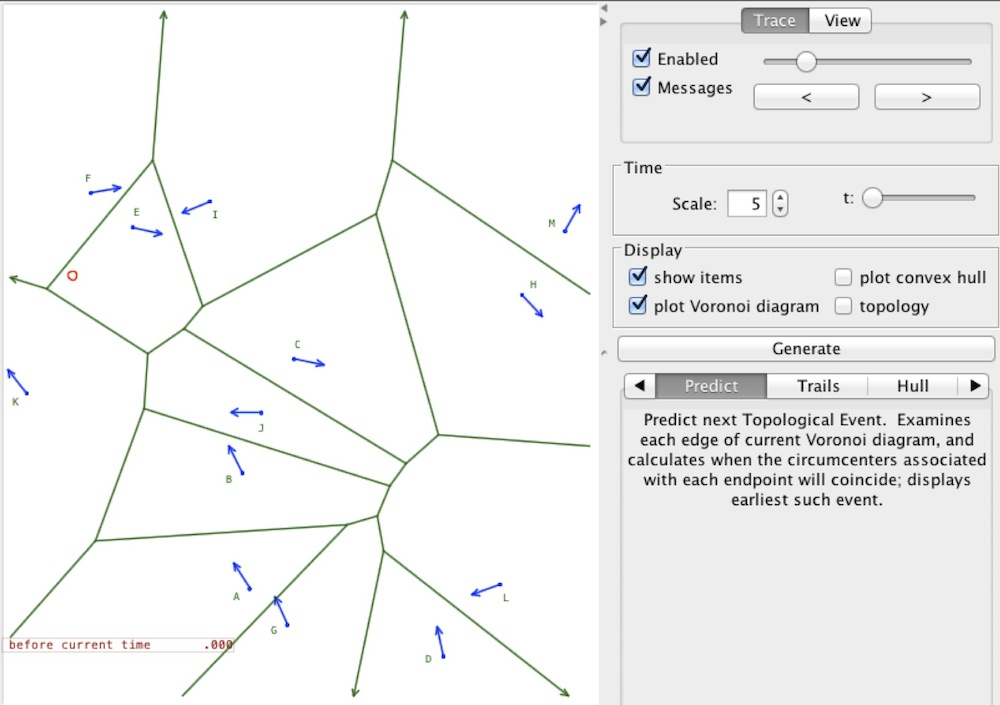
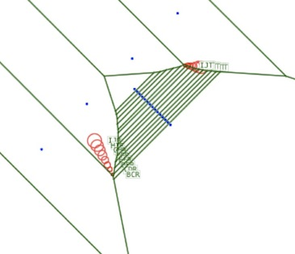
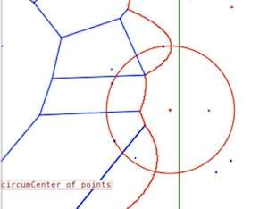

Voronoi Diagram of Moving Points
===========

This Java program explores an open problem in computational geometry. Given a set of points in the plane, each moving along a line with unit speed,
how many combinatorial changes are possible in the Voronoi diagram they induce?
(See [this link](http://cs.smith.edu/~orourke/TOPP/P2.html#Problem.2)
for a more detailed discussion of this problem.)

This figure demonstrates a simple configuration that shows that the number of changes is at least quadratic:

The program allows you to create a set of points and specify their initial velocities.
then displays the Voronoi diagrams and their combinatorial changes as you move forward and backward in time.
The convex hull of the points can also be displayed.
A point's speed is initially of unit magnitude, but can be modified by pressing the option key while dragging the point's arrowhead.

An interactive implementation of Fortune's plane sweep algorithm is also included:

The program can be run as an application; its main class is dynvorn.Main.class.
It can also be run as an applet, by loading the page "Applet.html" within a browser
(or from the command line: "appletviewer Applet.html").  In addition, the applet can be run [from here](http://www.cs.ubc.ca/~jpsember/cpsc516.html).

